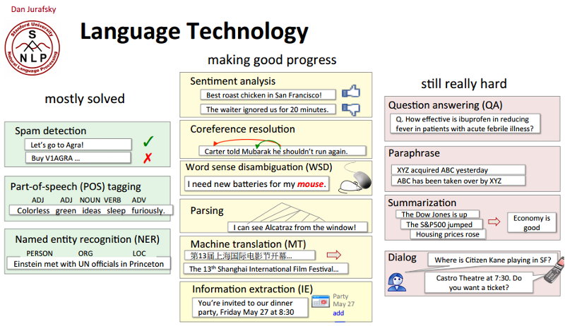
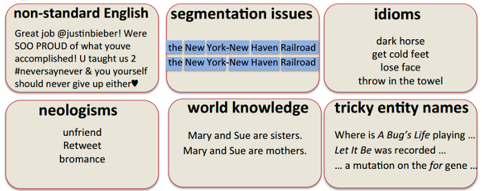

# Referencias

- *Intro to NLP*.[^intro-nlp]

- *What is Computational Linguistics?*[^what]

- *Perspectives in Computational Linguistics*.[^perspective]

- *The Stupidity of Computers*.[^stupidity]

- *An Inside Update on NLP*.[^update-nlp]

# ¿Qué es el PLN?

El Procesamiento del Lenguaje Natural (PLN)\footnote{En inglés, \textit{Natural Language Processing} (NLP) o mejor \#NLProc. La disciplina recibe otros nombres, como *Human Language Technologies* (HLT), tecnologías de la lengua, ingeniería lingüística, lingüística computacional, etc.} es el estudio científico del lenguaje desde un punto de vista computacional. Es un área claramente multidisciplinar que aglutina lingüística, ingeniería, inteligencia artificial, informática, psicología, etc.

El PLN se interesa en proporcionar modelos computacionales para describir, modelar o reproducir distintos fenómenos lingüísticos. Tradicionalmente, estos modelos han tenido dos aproximaciones diferentes:

1. sistemas basados en conocimiento: en problemas que podemos modelar, proporcionamos conocimiento lingüístico formalizado y las máquinas actuán aplicando reglas.

2. sistemas basados en estadística: en problemas que son costosos o no podemos modelar, proporcionamos ingentes cantidades de datos (colecciones de documentos) y dejamos que la máquina cree el modelo a partir del cálculo de probabilidades y la detección de patrones de uso.

El objetivo último del PLN reside en conseguir que los ordenadores analicen el lenguaje natural, lo comprendan y sean capaces de extraer significado de manera (que parezca) inteligente y resulte útil.

## Tareas típicas del PLN

Una buena manera de conocer los temas que trata un área de investigación es revisar el calendario de los congresos más importantes:[^calendar]
  
- ACL 2016: *call for papers*[^acl-cfp] y programa[^acl-cfp].

- EMNLP 2016: *call for papers*[^emnlp-cfp] y programa[^emnlp].

- COLING 2016: *call for papers*[^coling-cfp] y programa[^coling]

- SEPLN 2016: *call for papers*[^sepln-cfp]y programa[^sepln]

De este modo, podemos identificar algunas de las tareas más comunes del área:

- Desambiguación semántica (*word sense disambiguation*) y reconocimiento de entidades (*named entities recognition*).

- Análisis morfo-sintáctico (*[PoS tagging](http://nbviewer.ipython.org/gist/vitojph/5465948)/[parsing](http://nbviewer.ipython.org/gist/vitojph/5524353)*)

- Traducción automática (*machine translation*): [Google Translate](http://translate.google.es)

- Extracción de información (*information extraction*): [TripIt](https://www.tripit.com/)

- Reconocimiento del habla (*automatic speech reconition*) y síntesis de voz (*speech synthesis*): [Google Voice Search](http://www.google.com/insidesearch/features/voicesearch/index-chrome.html)

- Recuperación de información (*information retrieval*): [Google Search](),
  [Bing](http://www.bing.com) y [Wolfram|Alpha](http://www.wolframalpha.com/)

- Resumen automático (*automatic summarization*) y generación automática de textos: [Quakebot](http://www.latimes.com/local/earthquakes/) y [Automated Insights](http://automatedinsights.com/)

- Búsqueda de respuestas (*question answering*): [Ask.com](http://www.ask.com),
  [Watson](http://www.youtube.com/watch?v=WFR3lOm_xhE)

- Análisis de opiniones (*sentiment analysis*) [NaturalOpinions](http://demos.bitext.com/naturalopinions/)

- Comprensión del lenguaje natural (*natural language understanding*): [Siri](http://www.apple.com/es/ios/siri/), [Ok Google](https://support.google.com/websearch/answer/2940021?hl=es) y [Cortana](http://windows.microsoft.com/es-es/windows-10/getstarted-what-is-cortana)

## Problemas resueltos y cuestiones abiertas

# ¿Por qué es tan difícil el PLN?

El lenguaje natural es eminentemente **ambiguo**. Esta es la principal diferencia entre lenguas naturales y lenguajes artificiales.
  
Esta ambigüedad existe a varios niveles:

- ambigüedad fonética y fonológica: *vaca/baca*, *casa/caza*, *has sido tú/has ido tú*

- ambigüedad morfológica: *casa, beso, río, bajo*

- ambigüedad sintáctica: *Ayer me encontré a tu padre corriendo* 

- ambigüedad semántica: *banco*, *pie*, etc.

- ambigüedad de discurso: correferencia, resolución de anáforas.

Según la ACL (*Association for Computational Linguistics*): *Computational Linguistics, or Natural Language Processing (NLP), is not a new field*[^acl-faq], sin embargo no es sencillo definir los límites de la disciplina. Así que podemos considerarla como un conjunto de problemas relacionados con fenómenos lingüísticos y una amalgama de soluciones computacionales, de distinto tipo dependiendo del origen del investigador. 

Según xkcd,\footnote{http://www.xkcd.org/114/} los lingüistas computacionales han vivido muy bien hasta ahora vendiendo la moto, así que no se merecen más que nos metamos con ellos :-) \footnote{http://www.explainxkcd.com/wiki/index.php/
114:\_Computational\_Linguists}

[^intro-nlp]: Introduction to NLP http://futurewavewebdevelopment.com/wp/2016/08/brucemwhealton/introduction-to-natural-language-processing-nlp-2016-algorithmia-2/
[^update-nlp]: An Inside Update on NLP https://breakthroughanalysis.com/2016/06/23/jbnlp/
[^stupidity]: The Stupidity of Computers https://nplusonemag.com/issue-13/essays/stupidity-of-computers/
[^perspective]: Perspectives in Computational Linguistics http://www.linguisticsociety.org/content/computers-and-languages
[^what]: What is Computational Linguistics http://www.coli.uni-saarland.de/~hansu/what_is_cl.html

[^calendar]: NLP Conferences Calendar http://cs.rochester.edu/~omidb/nlpcalendar/
[^acl]: ACL 2016 Program http://acl2016.org/index.php?article_id=12
[^acl-cfp]: ACL 2016 CFP http://acl2016.org/index.php?article%20id=9
[^coling]: COLING 2016 Program http://coling2016.anlp.jp/
[^coling-cfp]: COLING 2016 CFP http://coling2016.anlp.jp/cfp/
[^emnlp]: EMNLP 2016 Program http://www.emnlp2016.net 
[^emnlp-cfp]: EMNLP 2016 CFP http://www.emnlp2016.net/call.html
[^sepln]: SEPLN 2016 Program http://www.congresocedi.es/es/sepln#tabs7
[^sepln-cfp]: SEPLN 2016 CFP http://www.wikicfp.com/cfp/servlet/event.showcfp?eventid=51713&copyownerid=85257 
[^acl-faq]: ACL FAQ http://www.aclweb.org/aclwiki/index.php?title=Frequently_asked_questions_about_Computational_Linguistics
